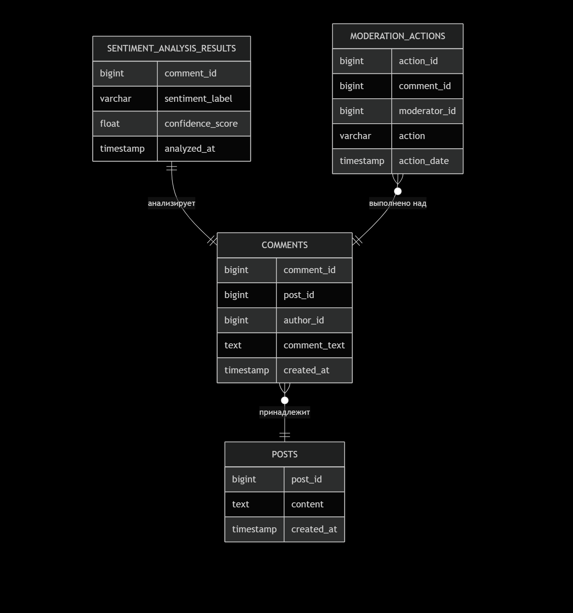

# Кейс №1: Система автоматического мониторинга тональности пользовательских комментариев

**Состав команды:**

* **Казарян Тигран** (роли: Product Owner, Data Scientist, Software/Data Architect, Data Engineer) *- проект выполняется индивидуально.*

---

## Графические модели (диаграммы)

1. **Модели бизнес-процессов (BPMN):**
[`diagrams/business_processes.md`](diagrams/business_processes.md)

### До:

### После:

2. **Диаграмма структуры данных (ER):**
[`diagrams/data_models.md`](diagrams/data_models.md)

3. **Диаграмма архитектуры системы:**
[`diagrams/system_architecture.md`](diagrams/system_architecture.md)

4. **Структурная UML-диаграмма (Компоненты):**
[`diagrams/uml_structure.md`](diagrams/uml_structure.md)

5. **Поведенческая UML-диаграмма (Последовательности):**
[`diagrams/uml_behavior.md`](diagrams/uml_behavior.md)

## 1. Цели и предпосылки

**Бизнес-цель:** Автоматизировать мониторинг пользовательских реакций на контент в соцсети для выявления негатива, улучшения модерации и повышения вовлеченности аудитории.

**Почему станет лучше?**

* **Скорость:** Анализ 500 000 комментариев в день станет мгновенным против выборочной ручной проверки.
* **Масштаб:** Охват 100% комментариев вместо <1%.
* **Объективность:** Четкость оценки, независимая от человеческого фактора и усталости модератора.
* **Безопасность:** Снижение риска штрафов от РКН за пропущенный негативный контент.

**Бизнес-требования и ограничения:**

* **Требования:** Выявление негативных комментариев с высокой точностью (>95%); Объединение с существующей системой модерации; Обработка до 500К комментариев/день.
* **Ограничения:** Соблюдение законодательства о данных (152-ФЗ); Минимизация ложноположительных срабатываний (чтобы не раздражать пользователей); Ограниченный бюджет на инфраструктуру.

**Функциональные требования (ФТ) и нефункциональные требования (НФТ):**

* **ФТ:** Классификация комментария по тональности (негативный/нейтральный/позитивный); Приоритизация очереди модерации (негативные — в начало); Формирование отчетов.
* **НФТ:** Производительность (<1 сек на комментарий); Доступность (99.9%); Масштабируемость.

**Процесс пилотного запуска и критерии успеха:**

* **Пилот:** Развертывание системы на 10% трафика (50К комментариев/день) на период 2 недели.
* **Критерии успеха:**

#### 1. Модель достигает F1-score >0.9 на тестовой выборке;
#### 2. Система снижает среднее время реакции на негатив с 24 часов до 1 часа;
#### 3. Модераторы подтверждают >85% автоматически выявленных негативных комментариев.

**MVP и технический долг:**

* **MVP (Минимальная жизнеспособная версия):** Модель, классифицирующая на 3 класса (негатив/нейтраль/позитив), базовые метрики, интеграция с одним каналом (например, комментарии к постам).
* **Технический долг:** Мультиязычность, анализ контекста (ответы на другие комментарии), кастомизация моделей под разные типы контента (новости vs реклама).

## 2. Методология

**Задача:** Многоклассовая классификация текста.

**Необходимые данные:**

1. *Обязательно:* Текст комментария, метка тональности (исторические данные модераторов).
2. *Желательно:* Контекст (к какому посту/рекламе комментарий), информация об авторе.
3. *Источники:* Логи модераций за прошлые периоды, публичные датасеты (например, RuSentiment).

**Метрики ML и их связь с бизнесом:**

* **Метрика ML:** **F1-score**. Баланс между точностью (Precision) и полнотой (Recall).
* **Связь с бизнесом:** Высокий F1-score означает, что система не пропускает много негатива (снижает риски) и не помечает зря нейтральные комментарии (не перегружает модераторов).

**Риски на этапе анализа/моделирования:**

* Недостаток размеченных данных.
  * **Решение:** Использование предобученных моделей (BERT), аугментация данных, активное обучение.
* Смещение в данных (модель плохо работает на сленге или новых темах).
  * **Решение:** Постоянное пополнение и ре-обучение модели на свежих данных.

**ML Pipeline (Жизненный цикл модели)**\
Для обеспечения непрерывной и эффективной работы системы машинного обучения мы проектируем следующий конвейер (ML Pipeline):

1. **Сбор данных:** Новые комментарии поступают в систему через брокер сообщений (Kafka). Пакетные данные (логи и датасеты) загружаются в объектное хранилище (S3/MinIO).

2. **Предобработка и фичеринжиниринг:** Входящий текст комментария очищается от HTML-тегов, лишних пробелов, приводится к нижнему регистру. Производится токенизация и лемматизация.

3. **Прогнозирование:** Обработанный текст подается на вход загруженной ML-модели. Модель возвращает вероятности принадлежности к классам "негативный", "нейтральный", "позитивный".

4. **Постобработка:** На основе пороговых значений вероятностей принимается финальное решение о классе комментария. Например, если вероятность "негатива" выше 0.7, комментарий помечается как негативный и помещается в начало очереди модерации.

5. **Сохранение результатов:** Результат классификации (прогноз, метка времени, ID комментария) сохраняется в базу данных (PostgreSQL) для дальнейшего использования UI модератора и построения отчетов.

6. **Мониторинг и обратная связь (Feedback Loop):** Действия модераторов (подтверждение или отклонение прогноза системы) логируются. Эти данные вместе с новыми комментариями периодично (например, раз в неделю/месяц) используются для переобучения модели, чтобы адаптировать ее к изменяющемуся языку и темам (борьба с Concept Drift).

## 3. Подготовка пилота

* **Способ оценки:** A/B тест. 10% трафика обрабатывается ИИ, 90% — по-старому. Сравнивается время реакции и качество модерации.
* **Успешный пилот:** Достигнуты критерии успеха, указанные выше.
* **Подготовка:** Разметка исторических данных, обучение baseline-модели, разработка API для интеграции.

## 4. Внедрение для production системы

**Инфраструктура и масштабируемость:**

* **Выбор:** Микросервисная архитектура на базе **Kubernetes** и **Docker**. Брокер сообщений **Apache Kafka** для обработки потоков данных. Хранилище объектов **MinIO/S3** для моделей, реляционная БД **PostgreSQL** для метаданных.
* **Плюсы:** Высокая доступность, легкое масштабирование, отказоустойчивость.
* **Минусы:** Сложность настройки и поддержки.

**Требования к работе системы:**

* **SLA:** 99.9% uptime.
* **RPS:** ~6 RPS (500К / (24*3600)).
* **Latency:** < 1 секунда на классификацию комментария (p95).

**Риски production:**

* Деградация модели во времени (Concept Drift).
  * **Митригация:** Система мониторинга качества предсказаний (A/B тесты с эталонной моделью, переобучение по расписанию).
* Резкий всплеск нагрузки (вирусный пост).
  * **Митригация:** Автоскейлинг и асинхронная обработка через Kafka.
