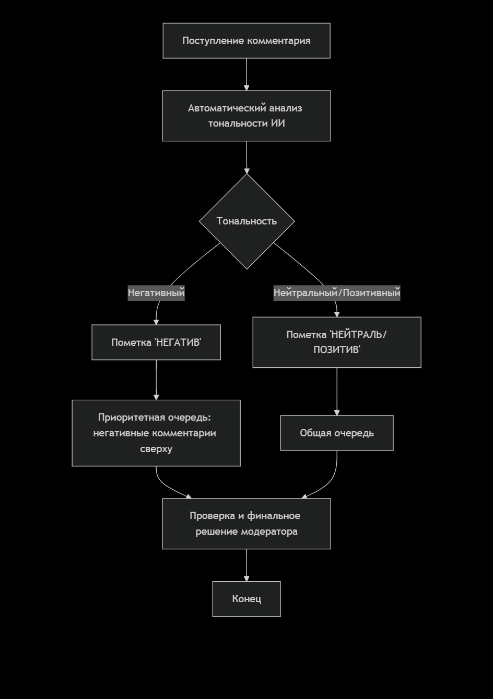

# Диаграммы бизнес-процессов

## Бизнес-процесс "Модерация комментариев" (До внедрения ИС)

**Проблемы:** Медленно, субъективно, охватывается малая доля комментариев. Негатив может долго оставаться незамеченным.

## Бизнес-процесс "Модерация комментариев" (После внедрения ИС)

**Что изменилось:**

1) Появился новый шаг "Автоматический анализ тональности ИИ".

2) Очередь модерации стала приоритетной: негативные комментарии проверяются в первую очередь.

3) Модератор не удален из процесса, но его работа оптимизирована за счет фокуса на самом важном контенте.