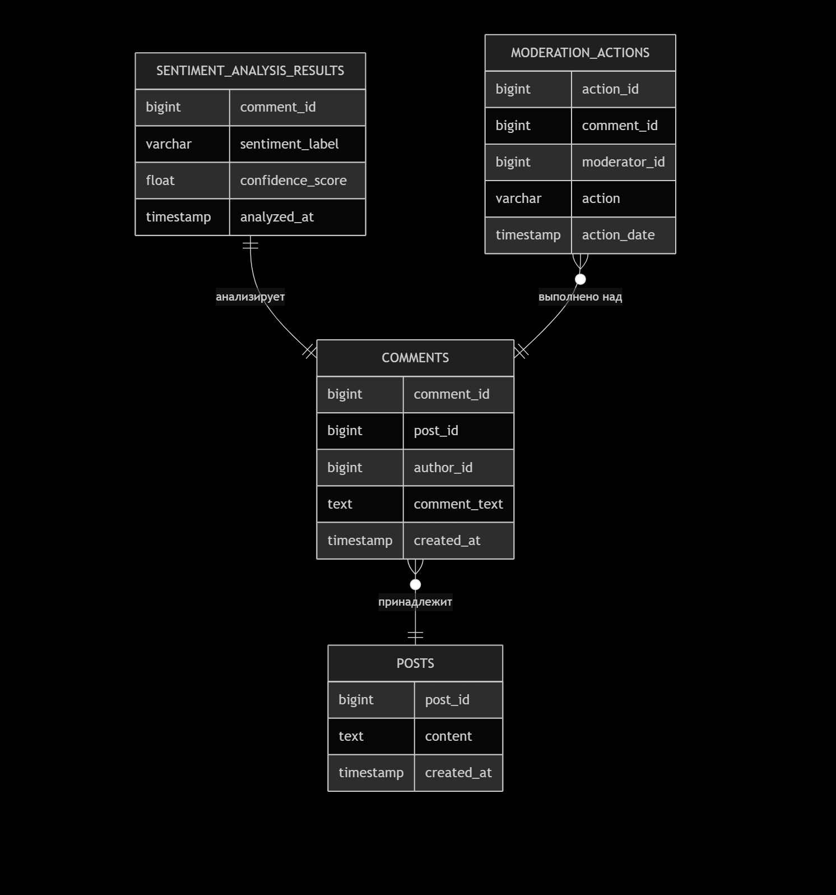

### **`diagrams/data_models.md`**

**Описание:**

**COMMENTS:** Основная сущность. Хранит текст комментария и его метаданные.

**SENTIMENT_ANALYSIS_RESULTS:** Результаты работы ML-системы. Связь "один к одному" с комментарием.

**POSTS и MODERATION_ACTIONS:** Вспомогательные сущности для контекста и аудита.

Мы выбрали **PostgreSQL** так как, нам нужны были надежные транзакций и сложные запросы для отчетности.