# Диаграмма архитектуры системы

# **Обоснование распределенного хранения данных:**

Данные хранятся в разных местах, так как у них разное назначение и требования к доступу:

**Kafka:** Быстрая, буферизированная обработка потоковых данных. Позволяет пережить пиковые нагрузки.

**PostgreSQL (Operational DB):** Для хранения результатов анализа, требующих быстрого доступа и оперативных запросов (например, для дашборда модератора).

**Object Storage (S3):** Для хранения больших объемов исторических данных (логов, сырых комментариев) и бинарных файлов моделей ML. Это дешево и надежно.

**Model Registry (MLflow):** Специализированное хранилище для управления версиями ML-моделей, их метаданными и этапами жизненного цикла.
